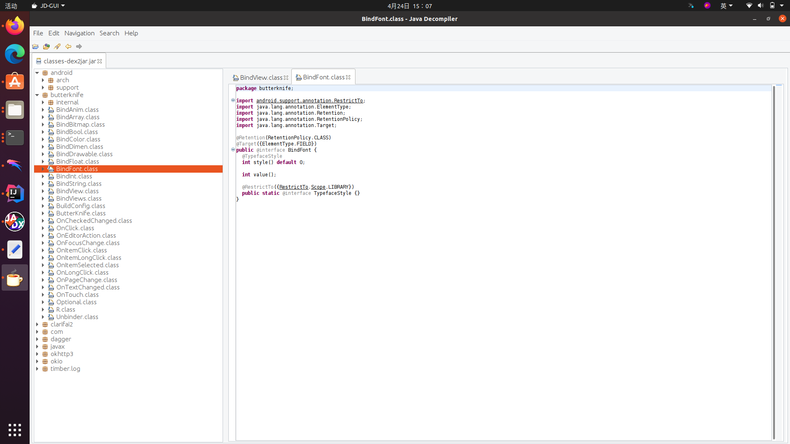
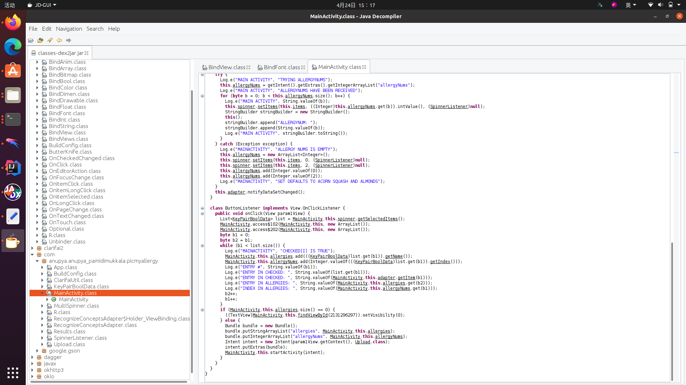

# Lab10 Decompile APK

worked by 11910507
The decompile result is in the Result directory.

## The components of APK

Download AXMLPrinter2.jar and then we can use command `java -jar AXMLPrinter2.jar AndroidManifest.xml > AndroidManifest.txt` to get the file.  
We can find that there is some number instead of words in some place. This is because the tool only decompile the xml file without looking for message in the apk file.

## Get program code

Download dex2jar.jar, and then we can use command `./d2j-dex2jar.sh classes.dex` to get the file.  
This can help us get the class file of the apk.

## Browse code

We can use jd-gui to read the source code.

MainActivity is here.

## Searching for String

I search the "screen" in the app. There are many "screen" in the app.

